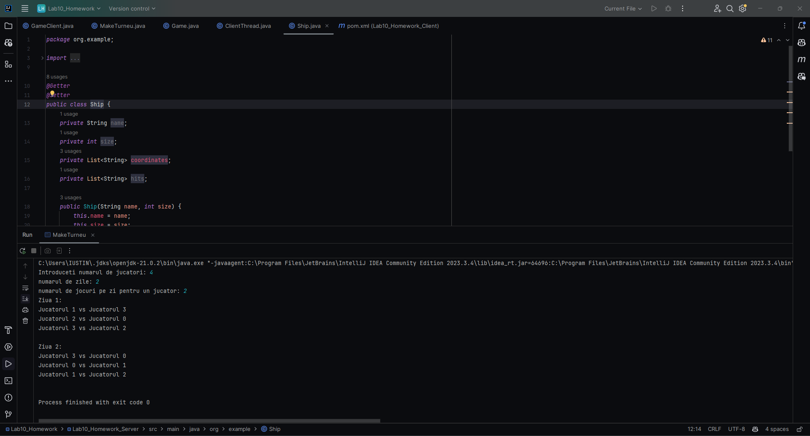

  #  Networking
Create an implementation of the Battleship game, that allows remote players to start or join games. The application will contain two parts (create a project for each one):
    The server is responsible with the game management and mediating the players.
    The client will communicate with the server, sending it commands such as:
        create or join a game,
        submit a move, etc. 

# Bonus 
## Description

This project implements a feature for organizing tournaments. Assuming there are `n` players registered on the server, the application creates a schedule such that:

1. Each player will play with every other player exactly once (the first player to move is chosen randomly).
2. A player cannot have more than `p` games in a day.
3. The tournament must finish in at most `d` days.

Once the schedule is created, random outcomes are generated for all games (there are no draws). The application then finds the sequence of players `p1, p2, ..., pn` such that `pi` beats `pi+1` for all `i` in `1, ..., n-1`.

