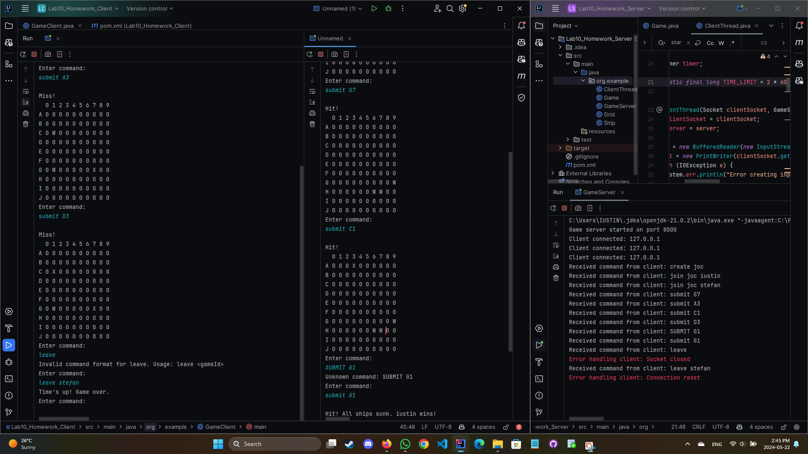

  #  Networking
Create an implementation of the Battleship game, that allows remote players to start or join games. The application will contain two parts (create a project for each one):
    The server is responsible with the game management and mediating the players.
    The client will communicate with the server, sending it commands such as:
        create or join a game,
        submit a move, etc. 

# Homework 

  ####  Create the OOP model and implement functionalities of the game.
  ####  The clients will send to the server commands such as: create game, join game, submit move, etc.
  ####  The server is responsible with the game management and mediating the players.
  ####  The games will be played under time control (blitz) with each player having the same amount of time at the beginning of the game. If a player's time runs out, the game is lost. 

********
