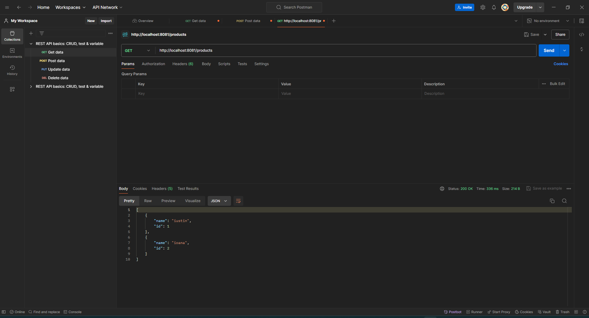
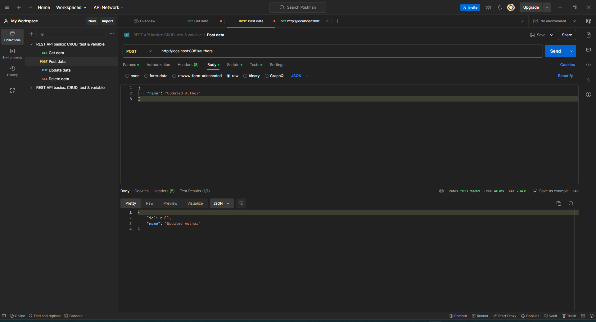
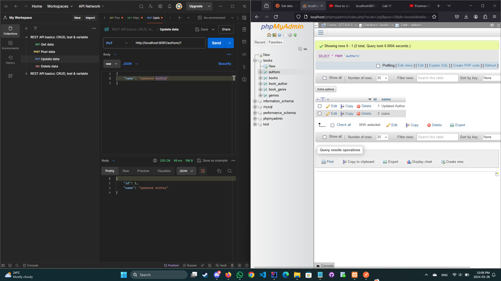

  #  Networking
Create an implementation of the Battleship game, that allows remote players to start or join games. The application will contain two parts (create a project for each one):
    The server is responsible with the game management and mediating the players.
    The client will communicate with the server, sending it commands such as:
        create or join a game,
        submit a move, etc. 

# Compulsory  

  ####  Create a Spring Boot project that will contain the REST services for comunicating with the server data.
  ####  Create a REST controller containing a method for:
  ####  obtaining the list of authors, via a HTTP GET request. 
  ####  Test your service using the browser and/or Postman, or RestMan, etc. 

