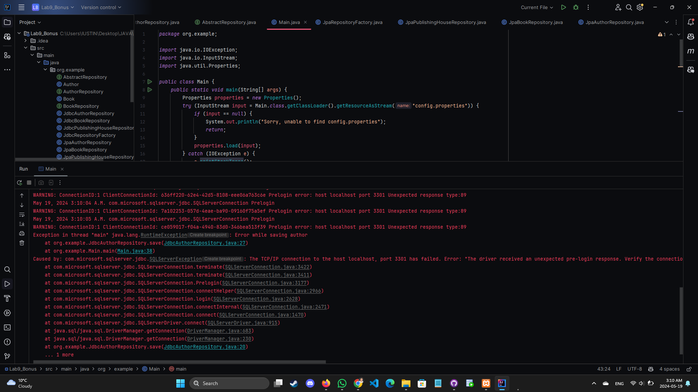

  # Persistence
Continue the application from lab 8, creating an object-oriented model and using JPA (Java Persistence API) in order to communicate with the relational database. 

# Bonus 

####   Implement both the JDBC and JPA data access classes and use an AbstractFactory in order to create the DAO objects (the repositories).
####    The application will use JDBC or JPA depending on a specified parameter stored in a .properties file.
####    Use a constraint solver, such as Choco solver, OptaPlanner or ORTools, in order to find a set of at least k books having titles that start with the same letter which are published in the same period of time (for any two books in the result, the difference between the years when they were published must not exceed a given value p). 

