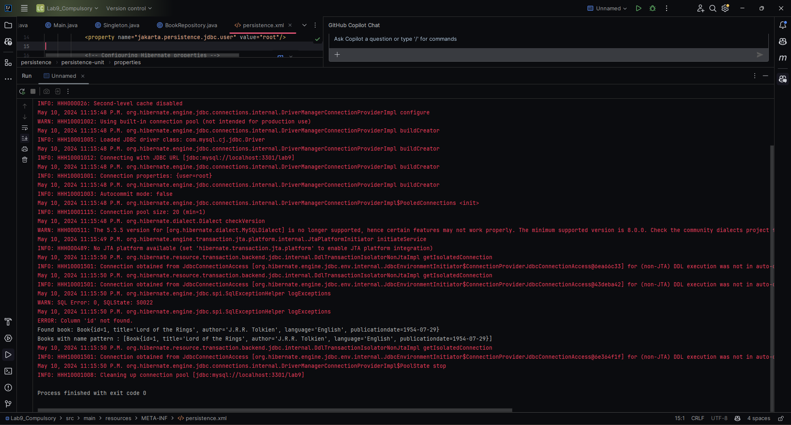

 # Persistence
Continue the application from lab 8, creating an object-oriented model and using JPA (Java Persistence API) in order to communicate with the relational database.

The main specifications of the application are:

# Compulsory 

####    Create a persistence unit (use EclipseLink or Hibernate or other JPA implementation).
####    Verify the presence of the persistence.xml file in your project. Make sure that the driver for EclipseLink or Hibernate was added to to your project classpath (or add it yourself).
####    Define the entity classes for your model (at least one) and put them in a dedicated package. You may use the IDE support in order to generate entity classes from database tables.
####    Create a singleton responsible with the management of an EntityManagerFactory object.
####    Define repository clases for your entities (at least one). They must contain the following methods:
        create - receives an entity and saves it into the database;
        findById - returns an entity based on its primary key;
        findByName - returns a list of entities that match a given name pattern. Use a named query in order to implement this method. 
####   Test your application. 

