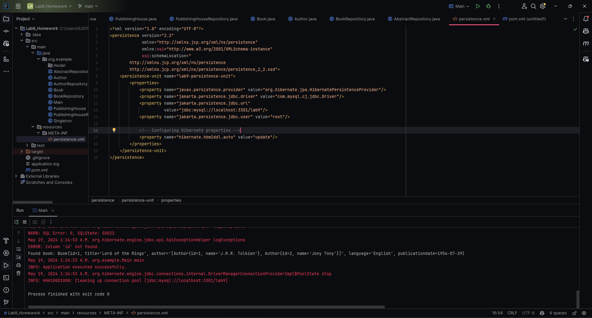
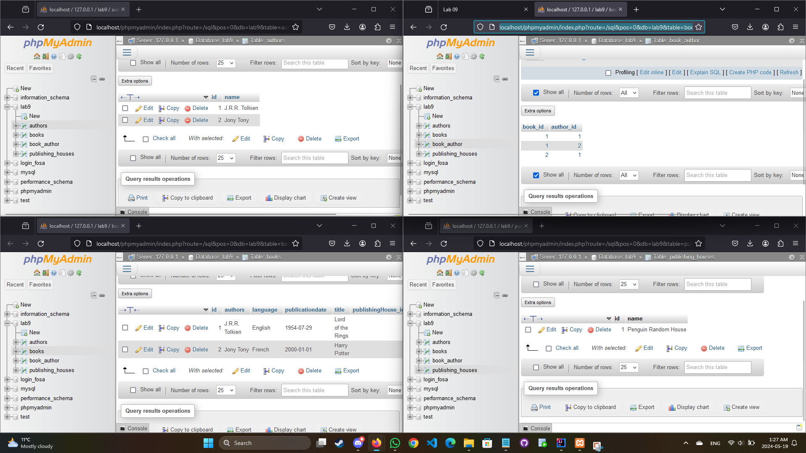
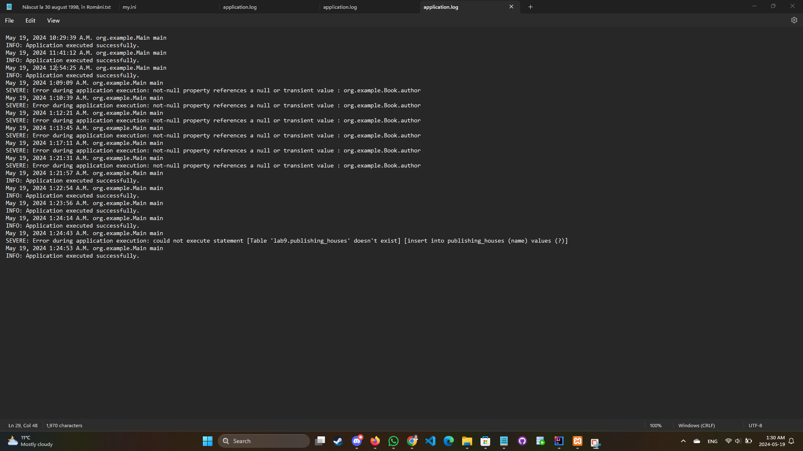

  # Persistence
Continue the application from lab 8, creating an object-oriented model and using JPA (Java Persistence API) in order to communicate with the relational database. 

# Homework 

  ####   In addition to the properties already existing, consider that each book has a publishing house.
  ####  Create all entity classes and repositories. Implement properly the one-to-many and many-to-many relationships.
  ####  Create a generic AbstractRepository using generics in order to simplify the creation of the repository classes. You may take a look at the CrudRepository interface from Spring Framework.
  ####  Use the Java logger in order to log the exceptions and the execution time of your JPQL statements (you should write the log messages both on screen and in a file). 

********
