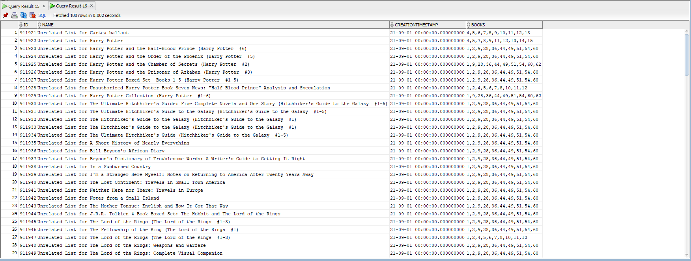

  # JDBC
Write an application that allows to connect to a relational database by using JDBC, submit SQL statements and display the results.
The application will manage a collection of books. Each book has some properties, such as: title, one or more authors, language, publication date, number of pages, etc.. 

# Bonus

 ####   Extend the model in order to create reading lists. A reading list has a name, a creation timestamp and a set of books.
 ####   Two books are related if they have a common author or share a common genre. Create an algorithm that partitions the collection of books into reading lists that contain only unrelated books. The number of lists should be "as small as possible" and any two lists should have the same size or differ by at most one

All unrelated books are recorded in the table on each line.
