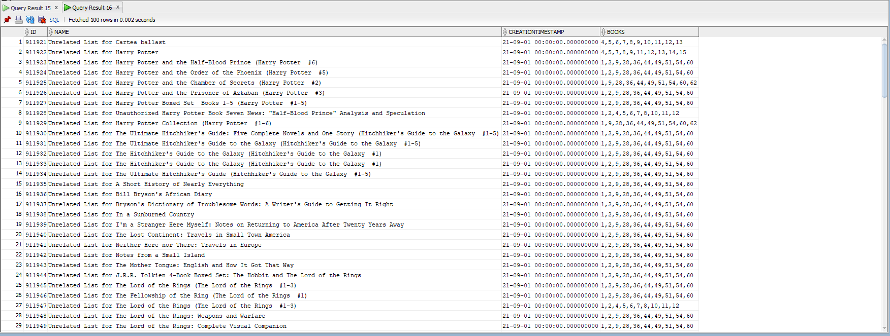

  # JDBC
Write an application that allows to connect to a relational database by using JDBC, submit SQL statements and display the results.
The application will manage a collection of books. Each book has some properties, such as: title, one or more authors, language, publication date, number of pages, etc.. 

# Bonus

 ####   Extend the model in order to create reading lists. A reading list has a name, a creation timestamp and a set of books.
 ####   Two books are related if they have a common author or share a common genre. Create an algorithm that partitions the collection of books into reading lists that contain only unrelated books. The number of lists should be "as small as possible" and any two lists should have the same size or differ by at most one

 ##### For each book r from the first 100 books, we call the createUnrelatedBookIdsWithR method to determine all books that are considered "unrelated" to that book r. This method filters the list of books to find those that have a maximum difference of one book in terms of authors and language compared to the book r.
 ##### Given the large size of the database (over 7000 rows), we have limited the process to the first 100 books in the database. This helps optimize search time and efficiently manage the large volume of data.
 ##### The ReadingList class is responsible for inserting a reading list into the database. This class receives an ID, a name, a publication date, and a list of book IDs. In the save method, the list of book IDs is concatenated into a string using commas as separators, and then this string is inserted into the database along with other information about the reading list.
