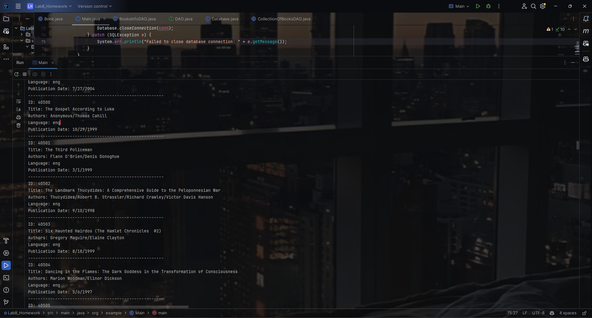
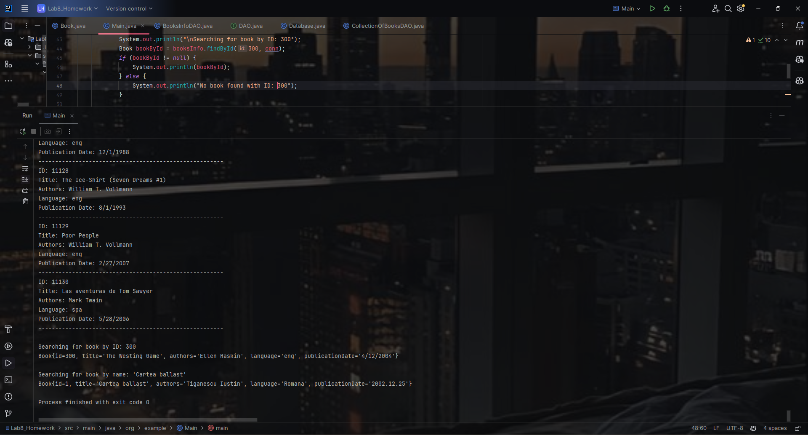

  # JDBC
Write an application that allows to connect to a relational database by using JDBC, submit SQL statements and display the results.
The application will manage a collection of books. Each book has some properties, such as: title, one or more authors, language, publication date, number of pages, etc.. 

# Homework 

  ####   Create an object-oriented model of the data managed by the Java application.
  ####   Implement all the DAO classes.
  ####  Use a connection pool in order to manage database connections, such as  [C3PO][https://www.mchange.com/projects/c3p0/], [HikariCP][https://github.com/brettwooldridge/HikariCP] or [Apache Commons DBCP][https://commons.apache.org/proper/commons-dbcp/].
  ####  Create a tool to import data from a real dataset, such as [Goodreads-books]([[URL](https://www.kaggle.com/datasets/jealousleopard/goodreadsbooks)] or other. 

